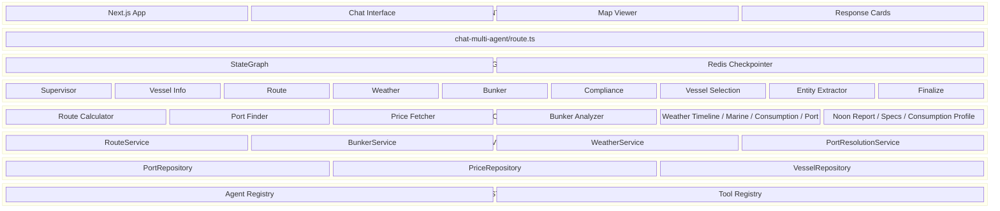

# FuelSense Architecture

## Overview

FuelSense 360 is a multi-agent system for maritime bunker optimization. LangGraph orchestrates specialist agents; each agent uses deterministic workflows or LLM tool-calling. Registries drive agent/tool discovery; valid agents are derived from the registry for scalability.

## High-Level Diagram



## Agent Flow

```
User Query → API → Supervisor (LLM) → Entity Extractor
                 → Vessel Info Agent (noon report, consumption, specs)
                 → Route Agent
                 → Weather Agent
                 → Bunker Agent
                 → Compliance Agent
                 → Vessel Selection Agent
                 → Finalize → AutoSynthesis → Template (or LLM fallback) → Response
```

## Query Routing (AI-FIRST 3-Tier Framework)

The supervisor uses an **AI-FIRST** routing strategy: LLM Intent Classification is primary, regex patterns are fallback.

```
Tier 1a: LLM Intent Classification (AI-FIRST)
         → IntentClassifier (GPT-4o-mini) maps query to agent
         → Confidence ≥ 70% → use classification
         → Cached results: <10ms (faster than regex!)
         → Redis cache: 7-day TTL

Tier 1b: Regex Pattern Matching (fallback)
         → When LLM fails, low confidence, or unavailable
         → PORT_WEATHER_PATTERNS, ROUTE_PATTERNS, BUNKER_PATTERNS, etc.
         → Deterministic extraction (ports, dates, origin/destination)

Tier 2:  Decision Framework
         → Confidence thresholds (80% act, 30–80% judgment, <30% clarify)

Tier 3:  LLM Reasoning (complex queries)
         → When neither Tier 1a nor 1b matches
         → Full Claude reasoning for ambiguous queries
```

**Benefits**: Handles natural language variations ("give me vessel names"), extracts parameters via LLM, regex fallback when LLM unavailable. Cost: ~$0.0001/query (GPT-4o-mini) with 7-day caching.

## Agents & Tools

| Agent | Type | Tools | Outputs |
|-------|------|-------|---------|
| supervisor | LLM | - | next_agent routing |
| entity_extractor | Deterministic | - | vessel_identifiers |
| vessel_info_agent | Deterministic | fetch_noon_report, fetch_vessel_specs, fetch_consumption_profile | vessel_specs, noon_reports, consumption_profiles |
| route_agent | Deterministic | calculate_route, calculate_weather_timeline | route_data |
| weather_agent | Deterministic | fetch_marine_weather, calculate_weather_consumption, check_bunker_port_weather | weather_forecast, weather_consumption |
| bunker_agent | Deterministic | (calls services directly) | bunker_analysis |
| compliance_agent | Deterministic | validate_eca_zones | compliance_data |
| vessel_selection_agent | Deterministic | (calls services directly) | vessel_comparison_analysis |
| finalize | LLM / Template | - | final_recommendation, synthesized_response |

## Finalize Response Flow (Template-First, LLM Fallback)

The Finalize agent uses a **template-first, LLM fallback** strategy so users always receive a response. When `LLM_FIRST_SYNTHESIS=true`, it uses **LLM-first** with template fallback.

### Default (Template-First)

```
Phase 1: AutoSynthesisEngine.synthesizeResponse(state)
         → AutoSynthesisResult (context, extracted_data, insights, recommendations, warnings)

Phase 2: Response rendering
         ├─ Has autoSynthesisResult?
         │   ├─ Template path: ContextAwareTemplateSelector.selectTemplate(context)
         │   │   → TemplateLoader.loadTemplate(name) returns { exists, name, template?, error? }
         │   │   → if exists: formatResponseWithTemplate(state, name)
         │   │   → if !exists or error: generateLLMResponse(synthesis, state)
         │   └─ LLM fallback: full synthesis context → Claude → markdown response
         └─ No synthesis: generateLegacyTextOutput(state) (direct formatting)
```

### LLM-First Synthesis (Feature-Flagged)

When `LLM_FIRST_SYNTHESIS=true`:

1. **Context Builder** produces compact, token-bounded summaries from synthesis data.
2. **LLM** generates response first (intent-aware: full list vs count, filter by type, etc.).
3. **Template fallback** if LLM fails.
4. Plan execution mode: unchanged (template-only, no LLM calls).

- **Context Builder** (`lib/multi-agent/synthesis/context-builder.ts`): Builds compact summaries per field (vessel, route, bunker, weather, etc.); caps total context at ~4K tokens.
- **TemplateLoader**: Returns status object `{ exists, name, template?, error? }` instead of throwing. Callers check `exists` before rendering.
- **LLM Response Generator** (`lib/multi-agent/llm-response-generator.ts`): Uses Context Builder for compact context; intent-aware prompt interprets user query for level of detail.
- **ContextAwareTemplateSelector**: Selects templates from synthesis context (primary_domain, query_type); extensible via `DOMAIN_TEMPLATES` and `QUERY_TYPE_TEMPLATES`.

### View Config (Map Hints)

`synthesized_response.view_config` signals when the frontend should show a map:

- `show_map: true`, `map_type: 'route'` – route intents (route_calculation, route_analysis)
- `show_map: true`, `map_type: 'bunker_ports'` – bunker intents
- `show_map: true`, `map_type: 'weather'` – weather intents (port_weather, route_weather)

Data for maps flows via `route_data`, `weather_data`, `bunker_data` SSE events; `synthesis_data` is included in `final_complete` payload.

## Registry-Driven Design

- **Valid agents**: Derived from `AgentRegistry.getAllAgents()` in graph.ts and agentic-supervisor.ts
- **Tool binding**: Agent definitions specify tool IDs; `AgentRegistry.getToolsForAgent(agentName)` returns executors
- **YAML config**: `config/agents/*.yaml` defines agent metadata; `loadAgentsFromYamlDirectory()` loads from YAML
- **Capability mapping**: `CAPABILITY_TOOL_MAP` maps capability names to tool IDs

## Component Locations

| Component | Location |
|-----------|----------|
| LangGraph | `frontend/lib/multi-agent/graph.ts` |
| Pattern Matcher (AI-FIRST routing) | `frontend/lib/multi-agent/pattern-matcher.ts` |
| Intent Classifier (GPT-4o-mini) | `frontend/lib/multi-agent/intent-classifier.ts` |
| Agent Registry (multi-agent) | `frontend/lib/multi-agent/registry.ts` |
| Agent Registry (lib) | `frontend/lib/registry/agent-registry.ts` |
| Tool Registry | `frontend/lib/registry/tool-registry.ts` |
| Vessel Info Agent | `frontend/lib/multi-agent/vessel-info-agent-node.ts` |
| Vessel Tools | `frontend/lib/tools/vessel-performance/` |
| Synthesis Engine | `frontend/lib/synthesis/synthesis-engine.ts` |
| Auto-Synthesis Engine | `frontend/lib/multi-agent/synthesis/auto-synthesis-engine.ts` |
| Context Builder | `frontend/lib/multi-agent/synthesis/context-builder.ts` |
| LLM Response Generator | `frontend/lib/multi-agent/llm-response-generator.ts` |
| Template Loader | `frontend/lib/config/template-loader.ts` |
| Context-Aware Template Selector | `frontend/lib/formatters/context-aware-template-selector.ts` |
| Template-Aware Formatter | `frontend/lib/formatters/template-aware-formatter.ts` |
| Service Container | `frontend/lib/repositories/service-container.ts` |

## Data Flow

```
Tool/Agent → Service → Repository → Cache (Redis) → DB (Supabase) / JSON fallback
         → External API (SeaRoute, OpenMeteo, FuelSense)
```

## Infrastructure

- **Redis (Upstash)**: Cache for ports, prices, routes, weather; LangGraph checkpointer
- **Supabase**: Database (optional)
- **Axiom**: Structured logging, agent/tool traces
- **FuelSense API**: Vessel master, datalogs (noon reports), consumption profiles
