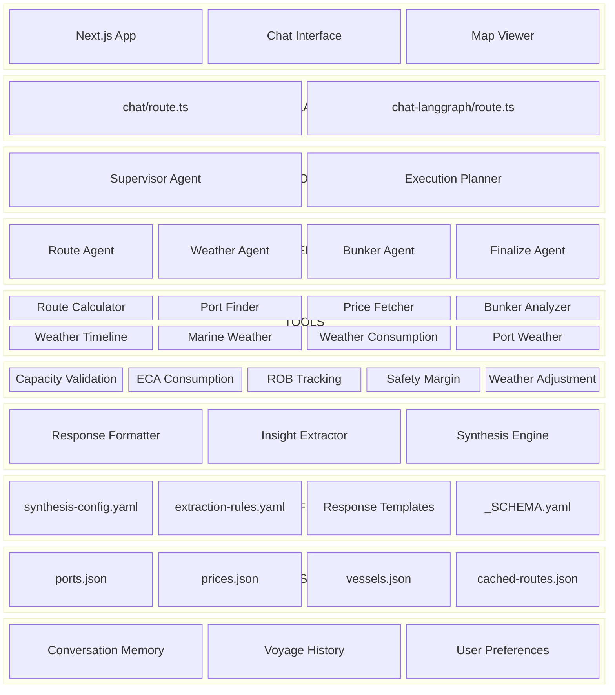

# FuelSense Architecture

## Layered Architecture Block Diagram

## Layer Summary

| Layer | Components |
|-------|------------|
| Frontend | Next.js App, Chat Interface, Map Viewer |
| API Layer | chat/route.ts, chat-langgraph/route.ts |
| Supervisor/Orchestrator | Supervisor Agent, Execution Planner |
| Agents | Route, Weather, Bunker, Finalize Agents |
| Tools | 8 tools (Route Calculator, Port Finder, Price Fetcher, etc.) |
| Engines | 5 engines (Capacity, ECA, ROB, Safety, Weather) |
| Formatters/Synthesis | Response Formatter, Insight Extractor, Synthesis Engine |
| YAML Configuration | synthesis-config.yaml, extraction-rules.yaml, templates |
| Data Resources | ports.json, prices.json, vessels.json, cached-routes.json |
| Memory (Future) | Conversation Memory, Voyage History, User Preferences |
