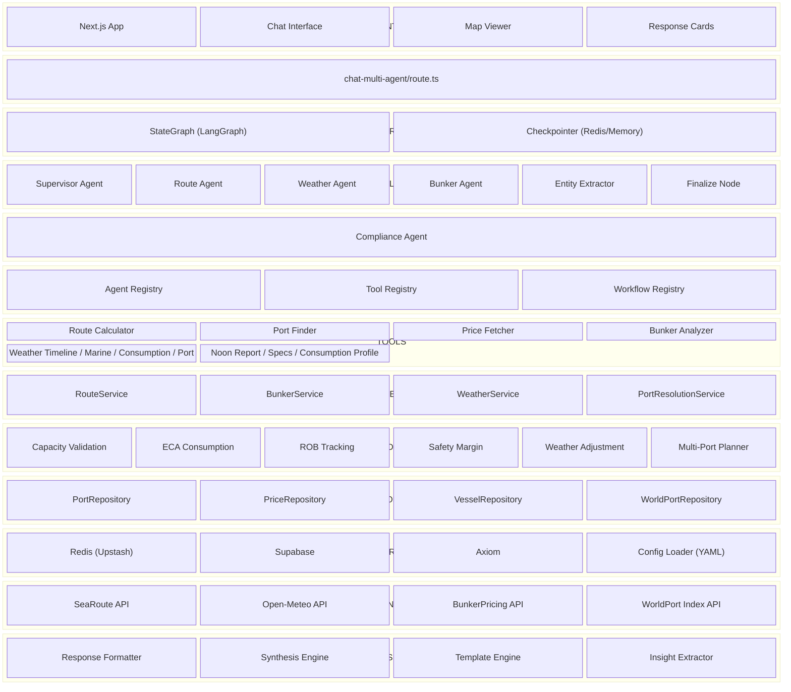
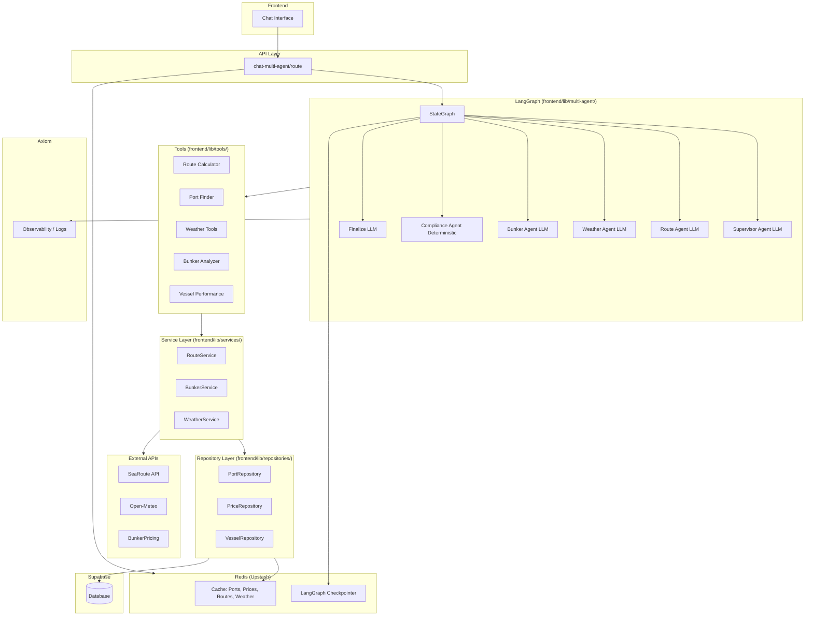
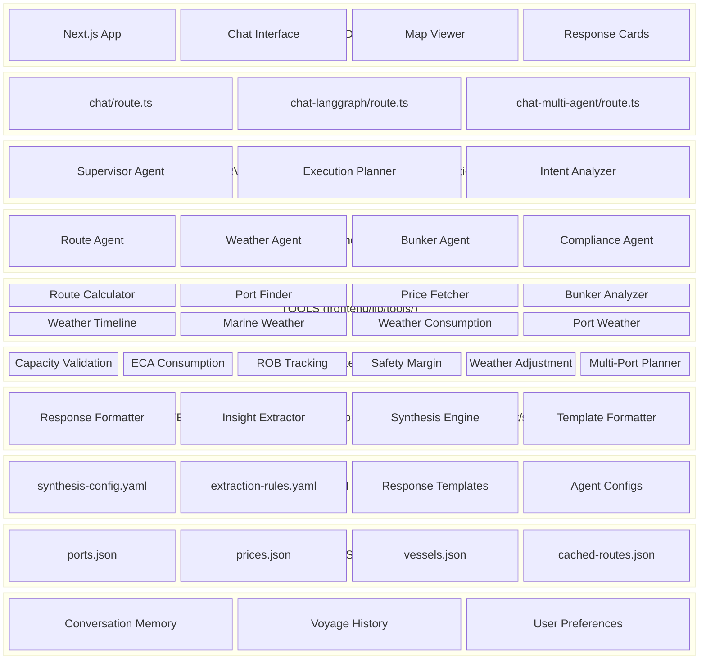
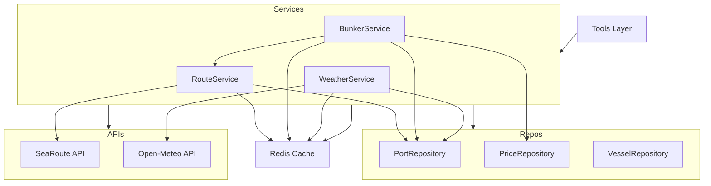
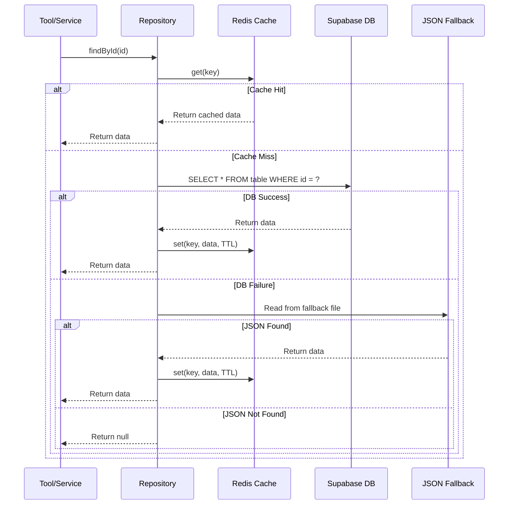
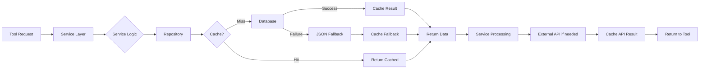
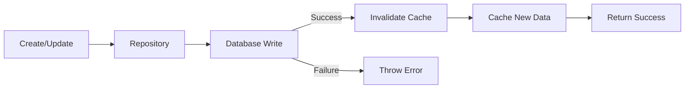

# FuelSense Architecture

## Complete High-Level Architecture Diagram



## Data Flow & Infrastructure Placement



## Component Placement Reference

| Component | Location | Type |
|-----------|----------|------|
| **LangGraph** | `frontend/lib/multi-agent/graph.ts` | StateGraph orchestration |
| **Redis** | Upstash | Cache (repos) + LangGraph checkpointer |
| **Axiom** | `frontend/lib/monitoring/axiom-logger.ts` | Structured logging, agent/tool traces |
| **Agent Registry** | `frontend/lib/registry/agent-registry.ts` | Agent discovery |
| **Tool Registry** | `frontend/lib/registry/tool-registry.ts` | Tool discovery |
| **Workflow Registry** | `frontend/lib/registry/workflow-registry.ts` | Workflow definitions |
| **Service Container** | `frontend/lib/repositories/service-container.ts` | DI for repos + services |

## Project Structure

```
FuelSense/
├── frontend/                    # Main Next.js application
│   ├── app/                     # Next.js App Router
│   │   ├── api/                 # API routes
│   │   │   ├── chat/            # Basic chat endpoint
│   │   │   ├── chat-langgraph/  # LangGraph-based chat
│   │   │   ├── chat-multi-agent/# Multi-agent orchestration
│   │   │   ├── monitoring/      # Performance monitoring
│   │   │   └── test-*/          # Test endpoints (weather, etc.)
│   │   ├── chat/                # Chat page
│   │   ├── chat-langgraph/      # LangGraph chat page
│   │   ├── chat-multi-agent/    # Multi-agent chat page
│   │   ├── analytics/           # Analytics dashboard
│   │   └── compare/             # Implementation comparison
│   ├── components/              # React components
│   │   ├── cards/               # Response card components
│   │   │   ├── comparison-result-card.tsx
│   │   │   ├── executive-decision-card.tsx
│   │   │   ├── informational-response-card.tsx
│   │   │   ├── priority-card.tsx
│   │   │   ├── risk-alert-card.tsx
│   │   │   └── validation-result-card.tsx
│   │   ├── template-response/   # Template-based response rendering
│   │   ├── ui/                  # Shadcn UI components
│   │   ├── bunker-response-viewer.tsx
│   │   ├── chat-interface-multi-agent.tsx
│   │   ├── map-viewer.tsx
│   │   ├── weather-card.tsx
│   │   └── voyage-timeline.tsx
│   ├── lib/                     # Core libraries
│   │   ├── config/              # Configuration loaders
│   │   ├── data/                # Static data (ports, prices, vessels)
│   │   ├── engines/             # Business logic engines
│   │   ├── formatters/          # Response formatters & synthesis
│   │   ├── langgraph/           # LangGraph implementation
│   │   ├── monitoring/          # Synthesis metrics
│   │   ├── multi-agent/         # Multi-agent orchestration
│   │   │   ├── synthesis/       # Response synthesis engine
│   │   │   └── helpers/         # Agent helpers
│   │   ├── registry/            # Agent/tool/workflow registries
│   │   ├── services/            # Business services
│   │   ├── tools/               # Agent tools
│   │   ├── types/               # TypeScript types
│   │   ├── utils/               # Utility functions
│   │   └── validators/          # Input validation
│   ├── config/                  # YAML configurations
│   │   ├── agents/              # Agent configurations
│   │   ├── validation-rules/    # Validation rules
│   │   └── workflows/           # Workflow definitions
│   └── tests/                   # Test suites
├── config/                      # Root-level configurations
│   ├── prompts/                 # LLM prompts
│   ├── insights/                # Insight extraction rules
│   └── response-templates/      # Response template schemas
└── src/                         # Legacy/standalone implementations
```

## Layered Architecture Block Diagram



## Layer Summary

| Layer | Location | Components |
|-------|----------|------------|
| Frontend | `frontend/app/`, `frontend/components/` | Next.js App, Chat Interface, Map Viewer, Response Cards |
| API Layer | `frontend/app/api/` | chat, chat-langgraph, chat-multi-agent routes |
| Supervisor/Orchestrator | `frontend/lib/multi-agent/` | Supervisor Agent, Execution Planner, Intent Analyzer |
| Agents | `frontend/lib/multi-agent/` | Route, Weather, Bunker, Compliance Agents |
| Tools | `frontend/lib/tools/` | 8 tools (Route Calculator, Port Finder, Weather tools, etc.) |
| **Service Layer** | `frontend/lib/services/` | **RouteService, BunkerService, WeatherService** |
| **Repository Layer** | `frontend/lib/repositories/` | **PortRepository, PriceRepository, VesselRepository, BaseRepository** |
| Engines | `frontend/lib/engines/` | 6 engines (Capacity, ECA, ROB, Safety, Weather, Multi-Port) |
| Formatters/Synthesis | `frontend/lib/formatters/`, `frontend/lib/multi-agent/synthesis/` | Response Formatter, Insight Extractor, Synthesis Engine |
| Registries | `frontend/lib/registry/` | Agent Registry, Tool Registry, Workflow Registry |
| YAML Configuration | `config/`, `frontend/config/` | synthesis-config.yaml, agent configs, templates |
| Data Resources | `frontend/lib/data/` | ports.json, prices.json, vessels.json, cached-routes.json |
| Infrastructure | `frontend/lib/repositories/` | Redis Cache, Supabase Database, ServiceContainer |
| Memory (Future) | - | Conversation Memory, Voyage History, User Preferences |

## Key Components

### Response Cards (`frontend/components/cards/`)
- **ExecutiveDecisionCard**: For decision-required queries with recommendations
- **InformationalResponseCard**: For general information queries
- **ValidationResultCard**: For validation/verification queries
- **ComparisonResultCard**: For comparison queries
- **PriorityCard**: For displaying prioritized items
- **RiskAlertCard**: For critical risk alerts

### Multi-Agent System (`frontend/lib/multi-agent/`)
- **Supervisor Planner**: Orchestrates agent execution
- **Agent Nodes**: Individual agent implementations
- **Synthesis Engine**: Combines agent outputs into coherent responses
- **Intent Analyzer**: Classifies query types

### Engines (`frontend/lib/engines/`)
- **Capacity Validation**: Validates vessel fuel capacity
- **ECA Consumption**: Calculates ECA zone fuel consumption
- **ROB Tracking**: Tracks Remaining on Board fuel
- **Safety Margin**: Ensures safety buffer calculations
- **Weather Adjustment**: Adjusts for weather conditions
- **Multi-Port Planner**: Plans multi-port bunkering strategies

## Service Layer Architecture

### Overview

The Service Layer (`frontend/lib/services/`) encapsulates complex business logic and provides a clean interface for tools and agents. Services orchestrate repositories, external APIs, and caching to deliver domain-specific functionality.

### Service Layer Diagram



### Services

#### RouteService (`frontend/lib/services/route.service.ts`)

**Purpose**: Calculates maritime routes with ECA zone detection and timeline calculation.

**Key Methods**:
- `calculateRoute(params)`: Calculate route between two ports with waypoints, timeline, and ECA segments

**Dependencies**:
- `PortRepository`: For port coordinate lookup
- `SeaRouteAPIClient`: External route calculation API
- `RedisCache`: For route caching (1 hour TTL)

**Features**:
- ECA zone detection using Turf.js
- Timeline calculation with ETAs
- Route type detection (Suez Canal, Panama Canal, transoceanic, direct)
- Cache-aware with automatic timeline adjustment for different departure dates

#### BunkerService (`frontend/lib/services/bunker.service.ts`)

**Purpose**: Finds bunker ports near routes and analyzes bunkering options.

**Key Methods**:
- `findBunkerPorts(params)`: Find bunker-capable ports within deviation distance of a route
- `analyzeBunkerOptions(params)`: Rank bunker ports by total cost (fuel + deviation)

**Dependencies**:
- `PortRepository`: For port data and bunker capability lookup
- `PriceRepository`: For current fuel prices
- `RouteService`: For route data
- `RedisCache`: For caching analysis results

**Features**:
- Deviation calculation from route segments
- Cost analysis including deviation penalties
- Fuel availability filtering
- Distance-based sorting

#### WeatherService (`frontend/lib/services/weather.service.ts`)

**Purpose**: Fetches marine weather data and calculates weather impact on fuel consumption.

**Key Methods**:
- `fetchMarineWeather(params)`: Fetch weather forecast for location and date
- `calculateWeatherImpact(params)`: Calculate fuel consumption multiplier based on weather
- `checkPortWeatherSafety(params)`: Assess bunkering safety based on weather conditions

**Dependencies**:
- `OpenMeteoAPIClient`: External marine weather API
- `PortRepository`: For port coordinate lookup
- `RedisCache`: For weather caching (15 minute TTL)

**Features**:
- Weather impact multipliers (wave height, wind speed)
- Safety rating calculation (safe/caution/unsafe)
- Port-specific weather safety checks
- Automatic caching with short TTL for frequently changing data

### Service Container (`frontend/lib/repositories/service-container.ts`)

**Purpose**: Dependency injection container using singleton pattern.

**Responsibilities**:
- Initialize infrastructure (Redis, Supabase)
- Initialize repositories
- Initialize services with proper dependencies
- Provide accessor methods for all components

**Usage**:
```typescript
const container = ServiceContainer.getInstance();
const routeService = container.getRouteService();
const portRepo = container.getPortRepository();
```

**Features**:
- Singleton pattern ensures single instance
- Graceful degradation (MockCache when Redis unavailable)
- Test support (`resetInstance()`, `cleanup()`)
- Lazy initialization on first access

## Repository Layer Architecture

### Overview

The Repository Layer (`frontend/lib/repositories/`) abstracts data access using a 3-tier fallback strategy: **Cache → Database → JSON Fallback**. This ensures high availability and performance while maintaining data consistency.

### 3-Tier Data Access Pattern



### BaseRepository (`frontend/lib/repositories/base-repository.ts`)

**Purpose**: Abstract base class providing common CRUD operations with 3-tier fallback.

**Key Methods**:
- `findById(id)`: Find entity with cache → DB → JSON fallback
- `findAll(filter?)`: Find all entities with optional filtering
- `create(data)`: Create new entity (DB only, then cache)
- `update(id, data)`: Update entity (DB, then invalidate cache)
- `delete(id)`: Delete entity (DB, then invalidate cache)

**Protected Methods** (for subclasses):
- `getCacheKey(id)`: Generate cache key
- `getCacheTTL()`: Get cache TTL (override for custom TTL)
- `loadFromFallback(id)`: Load from JSON file
- `invalidateCache(id?)`: Invalidate cache for entity or table

**Features**:
- Automatic cache management
- Graceful error handling at each tier
- Configurable TTL per repository
- Fallback path configuration

### Repositories

#### PortRepository (`frontend/lib/repositories/port-repository.ts`)

**Purpose**: Port data access with geospatial queries.

**Key Methods**:
- `findByCode(code)`: Find port by UNLOCODE
- `findBunkerPorts()`: Get all bunker-capable ports
- `findNearby(lat, lon, radiusNm)`: Find ports within radius using Haversine
- `searchByName(query)`: Case-insensitive name search

**Cache Strategy**:
- TTL: 24 hours (ports are stable data)
- Cache key format: `fuelsense:ports:{code}`

**Data Mapping**:
- JSON format: `{port_code, coordinates: {lat, lon}}`
- Repository format: `{code, coordinates: [lat, lon]}`

#### PriceRepository (`frontend/lib/repositories/price-repository.ts`)

**Purpose**: Fuel price data access with time-series queries.

**Key Methods**:
- `getLatestPrices(query)`: Get most recent prices for fuel types at port
- `getPriceHistory(query)`: Get historical prices over time period
- `getAveragePrices(query)`: Calculate average prices over period
- `addPrice(price)`: Insert new price record

**Cache Strategy**:
- TTL: 1 hour (prices change frequently)
- Cache key format: `fuelsense:prices:{portCode}:latest`

**Data Mapping**:
- JSON format: `{port_code, fuel_type, price_per_mt, last_updated}`
- Repository format: `{portCode, fuelType, priceUSD, date, updatedAt}`

#### VesselRepository (`frontend/lib/repositories/vessel-repository.ts`)

**Purpose**: Vessel profile data access with consumption calculations.

**Key Methods**:
- `findByName(name)`: Find vessel by name (case-insensitive)
- `findByIMO(imo)`: Find vessel by IMO number
- `getConsumptionAtSpeed(vesselId, speed)`: Interpolate consumption for speed
- `validateCapacity(vesselId, rob)`: Check if ROB fits within capacity

**Cache Strategy**:
- TTL: 24 hours (vessel profiles are stable)
- Cache key format: `fuelsense:vessels:{id}`

**Data Mapping**:
- JSON format: Complex nested structure with consumption profiles
- Repository format: Flattened with `atSea` array for speed-consumption curves

### Caching Strategy

#### Cache Key Naming Convention

```
fuelsense:{tableName}:{identifier}
```

Examples:
- `fuelsense:ports:SGSIN`
- `fuelsense:prices:SGSIN:latest`
- `fuelsense:vessels:vessel-001`
- `fuelsense:route:SGSIN-USNYC-14`

#### TTL Configuration

| Repository | TTL | Reason |
|------------|-----|--------|
| PortRepository | 24 hours | Stable reference data |
| PriceRepository | 1 hour | Frequently updated |
| VesselRepository | 24 hours | Stable vessel profiles |
| RouteService | 1 hour | Route data cached separately |
| WeatherService | 15 minutes | Weather changes frequently |

#### Cache Invalidation

- **Automatic**: On `update()` and `delete()` operations
- **Manual**: Via `invalidateCache(id)` or `invalidateCache()` for table-wide
- **Pattern-based**: `clear(pattern)` for bulk invalidation

#### Graceful Degradation

- **Cache unavailable**: Falls back to database, then JSON
- **Database unavailable**: Falls back to JSON, logs warning
- **MockCache**: No-op implementation when Redis unavailable (development/testing)

### Data Flow Diagrams

#### Complete Request Flow



#### Write Operation Flow



### Error Handling Strategy

1. **Cache Errors**: Log warning, continue to database
2. **Database Errors**: Log error, fall back to JSON
3. **JSON Errors**: Log error, return null
4. **External API Errors**: Log error, return cached data if available, otherwise throw

This ensures the system remains operational even when individual components fail.

## UX Design Patterns

### Progressive Disclosure Architecture

The response system follows industry-standard UX patterns for optimal user comprehension:

```
┌─────────────────────────────────────────────────────────────┐
│ TIER 0 (0-2 sec): Visual Context                           │
│ [INTERACTIVE MAP - Route + Bunker Ports + ECA Zones]       │
└─────────────────────────────────────────────────────────────┘

TIER 1 (2-5 sec): The Answer + Critical Decision
Singapore → Houston: 15,551 nm, 46 days, +9.7% weather

🚨 MULTI-STOP REQUIRED
Singapore + Gibraltar = $776K
⚠️ 2.7 days safety margin (need 3.0 minimum)

📊 Departure ROB: 850 MT VLSFO, 100 MT LSMGO

Next Steps:
1. 🔴 Execute immediate bunkering at Singapore for 914 MT
2. 🟡 Verify current Singapore bunker prices - data is stale

───────────────────────────────────────────────────────────────

TIER 2 (5-30 sec): Expandable Supporting Details
▼ 📋 Action Items (2)          [expanded by default]
▼ ⚠️ Critical Risks (2)        [expanded by default]
▶ ⛽ Fuel Tracking (3 waypoints) [collapsed]
▶ 🌊 Weather Impact              [collapsed]

TIER 3 (30+ sec): Technical Deep-Dive
▶ ⚓ ECA Compliance
▶ 📊 Alternative Ports
```

### Design Principles Applied

| Principle | Source | Application |
|-----------|--------|-------------|
| **F-Pattern Reading** | Nielsen Norman Group | Top line: key facts (left-to-right scan); Left edge: critical alerts (vertical scan) |
| **Miller's Law** | Cognitive Psychology | Max 5-6 items in Tier 1; Max 3-4 items per expandable card |
| **Progressive Disclosure** | UX Best Practice | Essential info visible; details on demand |
| **Inverted Pyramid** | Journalism | Most important first (decision), supporting details next, background last |
| **Scannable Content** | Web Writing | Short sentences, emoji icons, numerical data prominent |

### Information Hierarchy

| Tier | Time | Purpose | Max Items | Collapsed |
|------|------|---------|-----------|-----------|
| 0 | 0-2s | Visual orientation | 1 (map) | Never |
| 1 | 2-5s | Critical decision | 5-6 lines | Never |
| 2 | 5-30s | Supporting context | 3-4 per card | Mixed |
| 3 | 30s+ | Technical details | Unlimited | Always |

### Template Configuration

Response templates are defined in `config/response-templates/bunker-planning.yaml`:

```yaml
template:
  name: "F-Pattern Progressive Disclosure"
  version: "5.0.0"
  
  sections:
    - id: "route_map"
      tier: 0
      visibility: "always"
      
    - id: "executive_decision"
      tier: 1
      max_words: 80  # Strict limit for scannability
      
    - id: "action_items"
      tier: 2
      collapsed: false  # Important items start expanded
      
    - id: "eca_compliance"
      tier: 3
      collapsed: true  # Technical details hidden by default
```

### Success Metrics

| Metric | Before | Target |
|--------|--------|--------|
| Time to decision | ~45 seconds | 5-10 seconds |
| Cognitive load | High | Low |
| User satisfaction | Medium | High |

### References

- Nielsen Norman Group: [F-Shaped Pattern for Reading Web Content](https://www.nngroup.com/articles/f-shaped-pattern-reading-web-content/)
- Miller's Law: 7±2 items in working memory
- Google Material Design: Information Hierarchy
- Apple HIG: Progressive Disclosure
