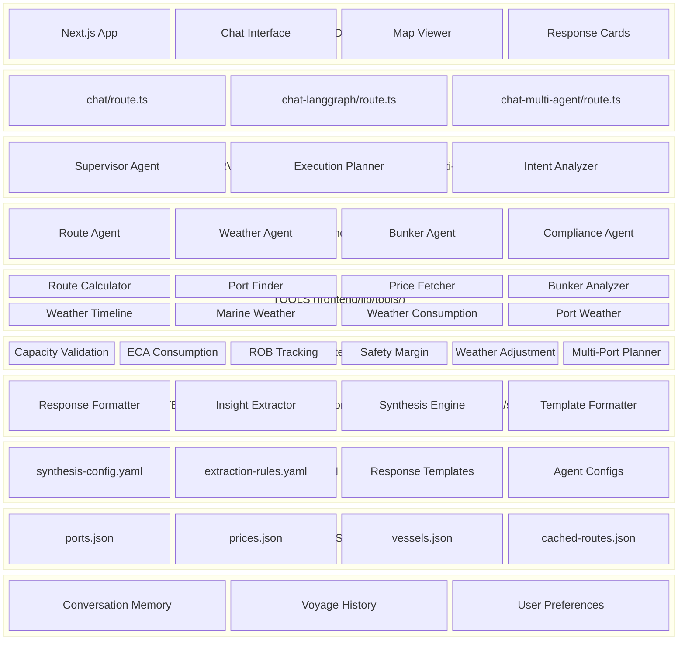

# FuelSense Architecture

## Project Structure

```
FuelSense/
├── frontend/                    # Main Next.js application
│   ├── app/                     # Next.js App Router
│   │   ├── api/                 # API routes
│   │   │   ├── chat/            # Basic chat endpoint
│   │   │   ├── chat-langgraph/  # LangGraph-based chat
│   │   │   ├── chat-multi-agent/# Multi-agent orchestration
│   │   │   ├── monitoring/      # Performance monitoring
│   │   │   └── test-*/          # Test endpoints (weather, etc.)
│   │   ├── chat/                # Chat page
│   │   ├── chat-langgraph/      # LangGraph chat page
│   │   ├── chat-multi-agent/    # Multi-agent chat page
│   │   ├── analytics/           # Analytics dashboard
│   │   └── compare/             # Implementation comparison
│   ├── components/              # React components
│   │   ├── cards/               # Response card components
│   │   │   ├── comparison-result-card.tsx
│   │   │   ├── executive-decision-card.tsx
│   │   │   ├── informational-response-card.tsx
│   │   │   ├── priority-card.tsx
│   │   │   ├── risk-alert-card.tsx
│   │   │   └── validation-result-card.tsx
│   │   ├── template-response/   # Template-based response rendering
│   │   ├── ui/                  # Shadcn UI components
│   │   ├── bunker-response-viewer.tsx
│   │   ├── chat-interface-multi-agent.tsx
│   │   ├── map-viewer.tsx
│   │   ├── weather-card.tsx
│   │   └── voyage-timeline.tsx
│   ├── lib/                     # Core libraries
│   │   ├── config/              # Configuration loaders
│   │   ├── data/                # Static data (ports, prices, vessels)
│   │   ├── engines/             # Business logic engines
│   │   ├── formatters/          # Response formatters & synthesis
│   │   ├── langgraph/           # LangGraph implementation
│   │   ├── monitoring/          # Synthesis metrics
│   │   ├── multi-agent/         # Multi-agent orchestration
│   │   │   ├── synthesis/       # Response synthesis engine
│   │   │   └── helpers/         # Agent helpers
│   │   ├── registry/            # Agent/tool/workflow registries
│   │   ├── services/            # Business services
│   │   ├── tools/               # Agent tools
│   │   ├── types/               # TypeScript types
│   │   ├── utils/               # Utility functions
│   │   └── validators/          # Input validation
│   ├── config/                  # YAML configurations
│   │   ├── agents/              # Agent configurations
│   │   ├── validation-rules/    # Validation rules
│   │   └── workflows/           # Workflow definitions
│   └── tests/                   # Test suites
├── config/                      # Root-level configurations
│   ├── prompts/                 # LLM prompts
│   ├── insights/                # Insight extraction rules
│   └── response-templates/      # Response template schemas
└── src/                         # Legacy/standalone implementations
```

## Layered Architecture Block Diagram



## Layer Summary

| Layer | Location | Components |
|-------|----------|------------|
| Frontend | `frontend/app/`, `frontend/components/` | Next.js App, Chat Interface, Map Viewer, Response Cards |
| API Layer | `frontend/app/api/` | chat, chat-langgraph, chat-multi-agent routes |
| Supervisor/Orchestrator | `frontend/lib/multi-agent/` | Supervisor Agent, Execution Planner, Intent Analyzer |
| Agents | `frontend/lib/multi-agent/` | Route, Weather, Bunker, Compliance Agents |
| Tools | `frontend/lib/tools/` | 8 tools (Route Calculator, Port Finder, Weather tools, etc.) |
| Engines | `frontend/lib/engines/` | 6 engines (Capacity, ECA, ROB, Safety, Weather, Multi-Port) |
| Formatters/Synthesis | `frontend/lib/formatters/`, `frontend/lib/multi-agent/synthesis/` | Response Formatter, Insight Extractor, Synthesis Engine |
| Registries | `frontend/lib/registry/` | Agent Registry, Tool Registry, Workflow Registry |
| YAML Configuration | `config/`, `frontend/config/` | synthesis-config.yaml, agent configs, templates |
| Data Resources | `frontend/lib/data/` | ports.json, prices.json, vessels.json, cached-routes.json |
| Memory (Future) | - | Conversation Memory, Voyage History, User Preferences |

## Key Components

### Response Cards (`frontend/components/cards/`)
- **ExecutiveDecisionCard**: For decision-required queries with recommendations
- **InformationalResponseCard**: For general information queries
- **ValidationResultCard**: For validation/verification queries
- **ComparisonResultCard**: For comparison queries
- **PriorityCard**: For displaying prioritized items
- **RiskAlertCard**: For critical risk alerts

### Multi-Agent System (`frontend/lib/multi-agent/`)
- **Supervisor Planner**: Orchestrates agent execution
- **Agent Nodes**: Individual agent implementations
- **Synthesis Engine**: Combines agent outputs into coherent responses
- **Intent Analyzer**: Classifies query types

### Engines (`frontend/lib/engines/`)
- **Capacity Validation**: Validates vessel fuel capacity
- **ECA Consumption**: Calculates ECA zone fuel consumption
- **ROB Tracking**: Tracks Remaining on Board fuel
- **Safety Margin**: Ensures safety buffer calculations
- **Weather Adjustment**: Adjusts for weather conditions
- **Multi-Port Planner**: Plans multi-port bunkering strategies
