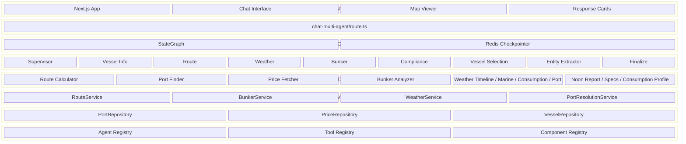

# FuelSense Architecture

## Overview

FuelSense 360 is a multi-agent system for maritime bunker optimization. LangGraph orchestrates specialist agents; each agent uses deterministic workflows or LLM tool-calling. Registries drive agent/tool discovery; valid agents are derived from the registry for scalability.

## High-Level Diagram



## Agent Flow

```
User Query → API → Supervisor (LLM) → Entity Extractor
                 → Vessel Info Agent (noon report, consumption, specs)
                 → Route Agent
                 → Weather Agent
                 → Bunker Agent
                 → Compliance Agent
                 → Vessel Selection Agent
                 → Finalize → ComponentMatcher → HybridResponse (text + components) or LLM synthesis → Response
```

## Query Routing (AI-FIRST 3-Tier Framework)

The supervisor uses an **AI-FIRST** routing strategy: LLM Intent Classification is primary, regex patterns are fallback.

```
Tier 1a: LLM Intent Classification (AI-FIRST)
         → IntentClassifier (GPT-4o-mini) maps query to agent
         → Confidence ≥ 70% → use classification
         → Cached results: <10ms (faster than regex!)
         → Redis cache: 7-day TTL

Tier 1b: Regex Pattern Matching (fallback)
         → When LLM fails, low confidence, or unavailable
         → PORT_WEATHER_PATTERNS, ROUTE_PATTERNS, BUNKER_PATTERNS, etc.
         → Deterministic extraction (ports, dates, origin/destination)

Tier 2:  Decision Framework
         → Confidence thresholds (80% act, 30–80% judgment, <30% clarify)

Tier 3:  LLM Reasoning (complex queries)
         → When neither Tier 1a nor 1b matches
         → Full Claude reasoning for ambiguous queries
```

**Benefits**: Handles natural language variations ("give me vessel names"), extracts parameters via LLM, regex fallback when LLM unavailable. Cost: ~$0.0001/query (GPT-4o-mini) with 7-day caching.

## Agents & Tools

| Agent | Type | Tools | Outputs |
|-------|------|-------|---------|
| supervisor | LLM | - | next_agent routing |
| entity_extractor | Deterministic | - | vessel_identifiers |
| vessel_info_agent | Deterministic | fetch_noon_report, fetch_vessel_specs, fetch_consumption_profile | vessel_specs, noon_reports, consumption_profiles |
| route_agent | Deterministic | calculate_route, calculate_weather_timeline | route_data |
| weather_agent | Deterministic | fetch_marine_weather, calculate_weather_consumption, check_bunker_port_weather | weather_forecast, weather_consumption |
| bunker_agent | Deterministic | (calls services directly) | bunker_analysis |
| compliance_agent | Deterministic | validate_eca_zones | compliance_data |
| vessel_selection_agent | Deterministic | (calls services directly) | vessel_comparison_analysis |
| finalize | LLM / Template | - | final_recommendation, synthesized_response |

## Finalize Response Flow (Component Registry)

The Finalize agent uses a **Component Registry** to map agent state to renderable React components. Data flows from state → Component Matcher → formatted response → HybridResponseRenderer.

### Component Registry Flow

```
Phase 1: Load component registry
         → loadComponentRegistry() from lib/config/component-registry.yaml
         → ComponentMatcherService(registry)

Phase 2: Match components to state
         → Query type from routing_metadata.matched_intent or synthesized_insights.query_type
         → matcher.matchComponents(state, queryType)
         → Filters by query_type_mappings (bunker_planning, route_calculation, weather_analysis, compliance_check)
         → Checks required_state_fields, render_conditions, resolves props via props_mapping

Phase 3: Build response
         ├─ Renderable components?
         │   ├─ Yes: componentManifest + generateContextualText() → type: 'hybrid'
         │   └─ No: synthesizeTextOnlyResponse() → type: 'text_only'
         └─ formatted_response: { type, text?, content?, components? }
```

### Component Registry Config (`lib/config/component-registry.yaml`)

- **Components**: RouteMap, CostComparison, ECAComplianceCard, WeatherTimeline with `required_state_fields`, `props_mapping`, `render_conditions`
- **Query type mappings**: bunker_planning → route_map, bunker_comparison, weather_timeline, eca_compliance; route_calculation → route_map; etc.
- **Fallback**: `llm_synthesis` when no components match; configurable model, temperature, max_tokens

### HybridResponseRenderer (`components/hybrid-response-renderer.tsx`)

- **Text-only**: Renders markdown via ReactMarkdown
- **Hybrid**: Renders context text + components from manifest; adapts registry props to component props (RouteMap, CostComparison, ComplianceCard, VoyageTimeline)
- **Unknown components**: Shows graceful degradation placeholder

### View Config (Map Hints)

`formatted_response` now carries `type` and `components` for the frontend. `synthesized_response.view_config` (legacy) signals map hints when available.

## Registry-Driven Design

- **Valid agents**: Derived from `AgentRegistry.getAllAgents()` in graph.ts and agentic-supervisor.ts
- **Tool binding**: Agent definitions specify tool IDs; `AgentRegistry.getToolsForAgent(agentName)` returns executors
- **YAML config**: `config/agents/*.yaml` defines agent metadata; `loadAgentsFromYamlDirectory()` loads from YAML
- **Capability mapping**: `CAPABILITY_TOOL_MAP` maps capability names to tool IDs
- **Component Registry**: `lib/config/component-registry.yaml` maps state fields → React components; `ComponentMatcherService` matches state to components; `HybridResponseRenderer` renders text + dynamic components

## Component Locations

| Component | Location |
|-----------|----------|
| LangGraph | `frontend/lib/multi-agent/graph.ts` |
| Pattern Matcher (AI-FIRST routing) | `frontend/lib/multi-agent/pattern-matcher.ts` |
| Intent Classifier (GPT-4o-mini) | `frontend/lib/multi-agent/intent-classifier.ts` |
| Agent Registry (multi-agent) | `frontend/lib/multi-agent/registry.ts` |
| Agent Registry (lib) | `frontend/lib/registry/agent-registry.ts` |
| Tool Registry | `frontend/lib/registry/tool-registry.ts` |
| Vessel Info Agent | `frontend/lib/multi-agent/vessel-info-agent-node.ts` |
| Vessel Tools | `frontend/lib/tools/vessel-performance/` |
| Synthesis Engine | `frontend/lib/synthesis/synthesis-engine.ts` |
| Auto-Synthesis Engine | `frontend/lib/multi-agent/synthesis/auto-synthesis-engine.ts` |
| Context Builder | `frontend/lib/multi-agent/synthesis/context-builder.ts` |
| LLM Response Generator | `frontend/lib/multi-agent/llm-response-generator.ts` |
| Template Loader | `frontend/lib/config/template-loader.ts` |
| Context-Aware Template Selector | `frontend/lib/formatters/context-aware-template-selector.ts` |
| Template-Aware Formatter | `frontend/lib/formatters/template-aware-formatter.ts` |
| Service Container | `frontend/lib/repositories/service-container.ts` |
| Component Registry Config | `frontend/lib/config/component-registry.yaml` |
| Component Loader | `frontend/lib/config/component-loader.ts` |
| Component Matcher Service | `frontend/lib/services/component-matcher.service.ts` |
| HybridResponseRenderer | `frontend/components/hybrid-response-renderer.tsx` |

## Data Flow

```
Tool/Agent → Service → Repository → Cache (Redis) → DB (Supabase) / JSON fallback
         → External API (SeaRoute, OpenMeteo, FuelSense)
```

## Infrastructure

- **Redis (Upstash)**: Cache for ports, prices, routes, weather; LangGraph checkpointer
- **Supabase**: Database (optional)
- **Axiom**: Structured logging, agent/tool traces
- **FuelSense API**: Vessel master, datalogs (noon reports), consumption profiles
