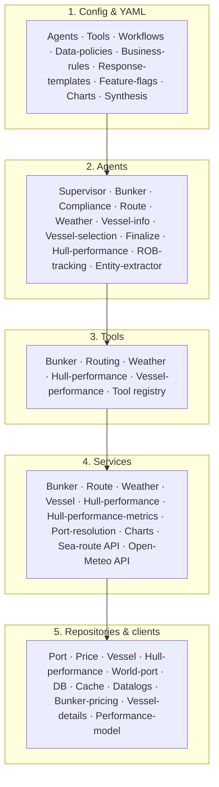

# FuelSense — High-Level Architecture

A layered view of **agents**, **tools**, **services**, **repositories**, and **config/YAML**. No data-flow connections — use this to explain “what lives where” and how layers sit on top of each other.

---

## Layered diagram (Mermaid)

```mermaid
flowchart TB
    subgraph config["Layer 1: Config & YAML"]
        direction TB
        L1_TOP[" "]
        subgraph agents_yaml["Agent configs"]
            A1["bunker-agent.yaml"]
            A2["compliance-agent.yaml"]
            A3["finalize.yaml"]
            A4["route-agent.yaml"]
            A5["supervisor.yaml"]
            A6["vessel-info-agent.yaml"]
            A7["vessel-selection-agent.yaml"]
            A8["weather-agent.yaml"]
        end
        subgraph tools_yaml["Tool configs"]
            T1["analyze-bunker-options.yaml"]
            T2["calculate-route.yaml"]
            T3["calculate-weather-*.yaml"]
            T4["find-bunker-ports.yaml"]
            T5["get-fuel-prices.yaml"]
            T6["fetch-marine-weather.yaml"]
            T7["check-bunker-port-weather.yaml"]
        end
        subgraph workflows_yaml["Workflows & engine"]
            W1["workflows: route-only, bunker-planning"]
            W2["engine-params: vessel-selection-calculation"]
            W3["feature-flags: phase-1-features"]
        end
        subgraph policies_yaml["Policies & rules"]
            P1["data-policies: bunker, compliance, route, weather, vessel-info, hull-performance"]
            P2["business-rules: safety, cost, compliance"]
            P3["validation-rules: core-rules"]
        end
        subgraph templates_yaml["Templates & knowledge"]
            R1["response-templates: default, bunker-planning, compliance_report, etc."]
            R2["knowledge: vessel-selection-knowledge"]
        end
        subgraph other_yaml["Other config"]
            O1["charts.yaml"]
            O2["component-registry.yaml"]
            O3["extraction-rules.yaml"]
            O4["synthesis-config.yaml"]
        end
    end

    subgraph agents["Layer 2: Agents"]
        L2_TOP[" "]
        direction TB
        subgraph registry_agents["Registry agents"]
            AG1["bunker-agent"]
            AG2["compliance-agent"]
            AG3["finalize-agent"]
            AG4["hull-performance-agent"]
            AG5["route-agent"]
            AG6["rob-tracking-agent"]
            AG7["supervisor-agent"]
            AG8["vessel-info-agent"]
            AG9["vessel-selection-agent"]
            AG10["weather-agent"]
        end
        subgraph multi_agent["Multi-agent / supervisor"]
            AG11["agentic-supervisor"]
            AG12["plan-first-agentic-supervisor"]
            AG13["entity-extractor-agent"]
        end
        subgraph infra_agents["Registry & loaders"]
            AG14["agent-registry / agent-loader"]
            AG15["agents.config / agent-schema"]
        end
    end

    subgraph tools["Layer 3: Tools"]
        L3_TOP[" "]
        direction TB
        subgraph registry_tools["Registry tools"]
            TL1["bunker-tools"]
            TL2["hull-performance-tools"]
            TL3["routing-tools"]
            TL4["vessel-performance-tools"]
            TL5["weather-tools"]
        end
        subgraph lib_tools["Lib / domain tools"]
            TL6["bunker-analyzer, price-fetcher, port-finder"]
            TL7["route-calculator, weather-timeline, weather-consumption"]
            TL8["port-weather, marine-weather, find-bunker-ports"]
            TL9["fetch-hull-performance, eca-zone-validator"]
        end
        subgraph tool_infra["Tool infra"]
            TL10["tool-registry / tool-loader"]
            TL11["tool-schema / tool-execution-wrapper"]
        end
    end

    subgraph services["Layer 4: Services"]
        L4_TOP[" "]
        direction TB
        subgraph domain_services["Domain services"]
            SV1["bunker.service / bunker-data-service"]
            SV2["route.service"]
            SV3["weather.service"]
            SV4["vessel-service / vessel-identifier-service"]
            SV5["hull-performance-service"]
            SV5a["hull-performance-metrics"]
            SV6["rob-from-datalogs-service"]
            SV7["port-resolution.service"]
            SV8["component-matcher.service"]
            SV9["vessel-specs-from-performance"]
        end
        subgraph chart_services["Chart services"]
            SV10["base-chart-service"]
            SV11["speed-consumption / speed-loss / excess-power"]
        end
        subgraph api_services["API clients (as services)"]
            SV12["sea-route-api-client"]
            SV13["open-meteo-api-client"]
        end
    end

    subgraph repos["Layer 5: Repositories & clients"]
        L5_TOP[" "]
        direction TB
        subgraph repositories["Repositories"]
            RP1["base-repository"]
            RP2["port-repository"]
            RP3["price-repository"]
            RP4["vessel-repository"]
            RP5["hull-performance-repository"]
            RP6["world-port-repository / world-port-repository-api"]
        end
        subgraph data_clients["Data clients"]
            RP7["db-client (Supabase)"]
            RP8["cache-client (Redis)"]
        end
        subgraph external_clients["External API clients"]
            RP9["datalogs-client"]
            RP10["bunker-pricing-client"]
            RP11["world-port-index-client"]
            RP12["vessel-performance-model-client"]
            RP13["vessel-details-client"]
            RP14["hull-performance-client / hull-performance-db-client"]
        end
    end

    L1_TOP --> L2_TOP --> L3_TOP --> L4_TOP --> L5_TOP
    classDef stackOrder fill:none,stroke:none,color:none
    class L1_TOP,L2_TOP,L3_TOP,L4_TOP,L5_TOP stackOrder
```

---

## Simplified “stack” view (good for slides)

Same layers, fewer boxes — useful for a quick “stack” explanation:

---

## Layer summary (for talking through it)

| Layer | What it is | Where it lives |
|-------|------------|----------------|
| **1. Config & YAML** | Agent definitions, tool configs, workflows, data policies, business/validation rules, response templates, feature flags, charts, synthesis | `frontend/config/`, `config/`, `frontend/lib/config/` |
| **2. Agents** | Domain agents (bunker, route, weather, vessel, compliance, etc.) and supervisor/orchestration | `frontend/lib/registry/agents/`, `frontend/lib/multi-agent/` |
| **3. Tools** | Tools agents call: bunker, routing, weather, hull-performance, vessel-performance; plus tool registry | `frontend/lib/registry/tools/`, `frontend/lib/tools/` |
| **4. Services** | Business logic and API wrappers: bunker, route, weather, vessel, hull-performance, charts. Default chart period is last 6 months from the vessel's last report date; excess power % and speed loss % are always computed from last 6 months from the vessel's last report date (hull-performance-metrics, linear best-fit last y), regardless of user-selected period. | `frontend/lib/services/` |
| **5. Repositories & clients** | Data access and external APIs: ports, prices, vessels, hull performance, DB, cache, datalogs, bunker pricing | `frontend/lib/repositories/`, `frontend/lib/clients/`, `frontend/lib/api-clients/` |

---

## File locations (quick reference)

- **Agents (YAML):** `frontend/config/agents/*.yaml`
- **Tools (YAML):** `frontend/config/tools/*.yaml`
- **Agents (code):** `frontend/lib/registry/agents/`, `frontend/lib/multi-agent/`
- **Tools (code):** `frontend/lib/registry/tools/`, `frontend/lib/tools/`
- **Services:** `frontend/lib/services/` (includes hull-performance-service, hull-performance-metrics for excess power % and speed loss % from best-fit)
- **Repositories:** `frontend/lib/repositories/`
- **Clients:** `frontend/lib/clients/`, `frontend/lib/api-clients/`
